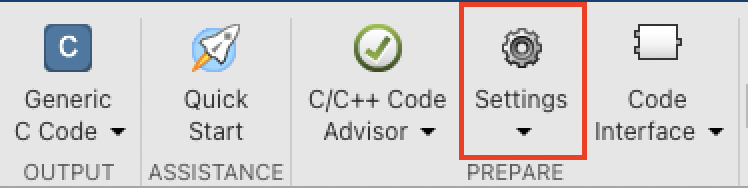
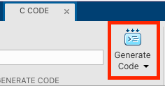
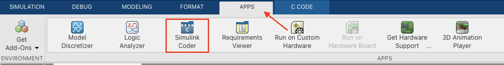
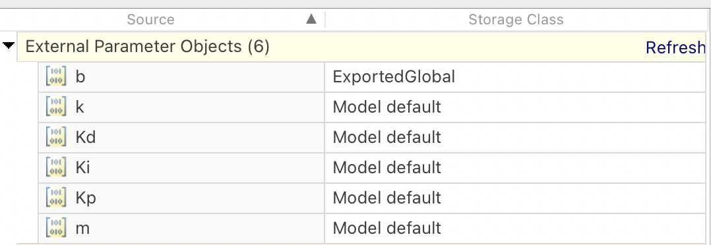

## Export Code from Simulink

In a first step make sure that all the signals, outputs, inputs and parameters have a (unique) descriptive name. This will make it a lot easier to associate them later in the generated model.
It is also the time to decide which signals are relevant and how important certain symbols are, because we should define a [Storage Classes](https://www.mathworks.com/help/rtw/ug/choose-a-built-in-storage-class-for-controlling-data-representation-in-the-generated-code.html) for every 
signal, output, input and parameter we would like to access later through the python bindings. Per default everything that has a user set name, will have the "Model default" Storage Class assigned.

In the `C Code` tab (Top bar `Apps` -> `Simulink Code`) open `Settings`.



We go through the menus and verify the correct settings:
- `Solver`
  - The `Type` of the `Solver selection` needs to be set to `Fixed step`. The `Solver` can be set to `auto` (or to a specific model if needed). The start and stop time is not relevant.
- `Date Import/Export` 
  - everything should be unchecked.
- `Code Generation`
  - `System target file` should be `grt.tlc` (Generic real-time target)
  - `Language` -> `C`
  - Check `Generate code only`
  - Check `Package code and artifacts` and define a name for the zip file
  - In the submenu `Interface`
    - Go to `Advanced parameters` often only shown as three dots `...` after all the other properties
      - Uncheck `MAT-file logging` (mostly we do not need this feature, SliM-Pyb can also handle it if this keeps checked)

Once everything is set correctly the code can be generated pressing generate code.


There should be a zip file in your matlab project folder now. The content is needed to generate the binaries and the python bindings.

### Assigning a Storage Class

There are basically two ways of assigning a Storage Class to a symbol.

#### With Matlab Code
From a Matlab file (`.m`) it is possible to define [Simulink.Parameter](https://www.mathworks.com/help/simulink/slref/simulink.parameter.html). They offer some configurations, but now we are only interested in the `CoderInfo.StorageClass`.

```matlab
variableName = Simulink.Parameter;
variableName.Value = 1;
variableName.CoderInfo.StorageClass = 'SimulinkGlobal';
```

For more information on the available `StorageClasses` visit the Matlab docs: [Storage Classes](https://www.mathworks.com/help/rtw/ug/choose-a-built-in-storage-class-for-controlling-data-representation-in-the-generated-code.html)


#### With GUI

Open your Simulink Model. There in the top bar select `Apps` -> `Simulink Coder`.



Now there should be a new tab in the bottom left of the windows.


There you can browse through the different types and change the Storage Class.


